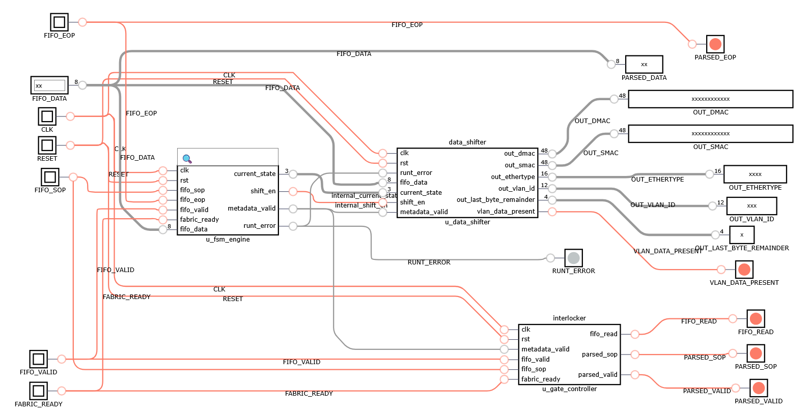

# L2 Packet Parser with 802.1Q VLAN Support

A high-performance, modular, zero-latency cut-through Layer 2 Ethernet Packet Parser implemented in synthesizable Verilog. This architecture extracts critical network routing metadata (Destination MAC, Source MAC, EtherType, and 802.1Q VLAN tags) on-the-fly while streaming packet payloads directly to a downstream switch fabric.

---

## Complete Structural Component Diagram

The following structural schematic shows exactly how the control, data storage, and output gating highways cross-connect internally inside the top-level wrapper module:



```text
=======================================================================================================================
                                            TOP-LEVEL WRAPPER (L2_PACKET_PARSER)
=======================================================================================================================

     UPSTREAM FIFO INTERFACE                                                               DOWNSTREAM SWITCH FABRIC
    ┌────────────────────────┐                                                            ┌────────────────────────┐
    │  FIFO_DATA [7:0]       ├═════════════════╤═════════════════════════════════════════►│  PARSED_DATA [7:0]     │
    │  FIFO_SOP              ├──────────┐      │                                          │                        │
    │  FIFO_EOP              ├───────┐  │      │                                    ┌────►│  PARSED_SOP            │
    │  FIFO_VALID            ├───┐   │  │      │                                    │ ┌──►│  PARSED_EOP            │
    │                        │   │   │  │      │                                    │ │ ┌►│  PARSED_VALID          │
    │  FIFO_READ             │◄──┼───┼──┼──────┼───────────────┐                    │ │ │ │                        │
    └────────────────────────┘   │   │  │      │               │                    │ │ │ │  FABRIC_READY          │
                                 │   │  │      │               │                    │ │ │ └──────────┬─────────────┘
                                 │   │  │      │               │                    │ │ │            │
    ┌────────────────────────┐   │   │  │      │               │                    │ │ │            │
    │  CLK                   ├───┼───┼──┼──────┼───────────────┼───────┐            │ │ │            │
    │  RST                   ├───┼───┼──┼──────┼───────────┐   │       │            │ │ │            │
    └────────────────────────┘   │   │  │      │           │   │       │            │ │ │            │
                                 v   v  v      v           v   v       v            │ │ │            │
      ┌──────────────────────────────────────────────────┐ │   │       │            │ │ │            │
      │ COMPONENT A: l2_parser_fsm_engine                │ │   │       │            │ │ │            │
      │                                                  │ │   │       │            │ │ │            │
      │   .fifo_valid     (FIFO_VALID)                   │ │   │       │            │ │ │            │
      │   .fifo_sop       (FIFO_SOP)                     │ │   │       │            │ │ │            │
      │   .fifo_eop       (FIFO_EOP)                     │ │   │       │            │ │ │            │
      │   .fifo_data      (FIFO_DATA)                    │ │   │       │            │ │ │            │
      │   .fabric_ready   (FABRIC_READY) ◄───────────────┼─╪───┼───────┼────────────┼─┼─┼────────────┘
      │                                                  │ │   │       │            │ │ │
      │   .current_state  (internal_current_state) ────┐ │ │   │       │            │ │ │
      │   .shift_en       (internal_shift_en) ─────┐   │ │ │   │       │            │ │ │
      │   .metadata_valid (internal_metadata_valid)╪   ╪ ╪ ╪   ╪       │            │ │ │
      │   .runt_error     (internal_runt_error) ─┐ │   │ │ │   │       │            │ │ │
      └──────────────────────────────────────────╪─╪───╪─╪─╪───┼───────┼────────────┼─┼─┼────────────┐
                                                 │ │   │ │ │   │       │            │ │ │            │
                                                 v v   v v v   │       │            │ │ │            │
      ┌──────────────────────────────────────────────────┐     │       │            │ │ │            │
      │ COMPONENT B: data_shifter                        │     │       │            │ │ │            │
      │                                                  │     │       │            │ │ │            │
      │   .current_state  (internal_current_state) ◄─────┼─────┘       │            │ │ │            │
      │   .shift_en       (internal_shift_en)            ┼─────────────┘            │ │ │            │
      │   .metadata_valid (internal_metadata_valid) ◄────┼─────────────┐            │ │ │            │
      │   .runt_error     (internal_runt_error) ◄────────┘             │            │ │ │            │
      │   .fifo_data      (FIFO_DATA)                                  │            │ │ │            │
      │                                                                │            │ │ │            │
      │   .out_dmac                ──────► OUT_DMAC [47:0]             │            │ │ │            │
      │   .out_smac                ──────► OUT_SMAC [47:0]             │            │ │ │            │
      │   .out_ethertype           ──────► OUT_ETHERTYPE [15:0]        │            │ │ │            │
      │   .out_vlan_id             ──────► OUT_VLAN_ID [11:0]          │            │ │ │            │
      │   .out_last_byte_remainder ──────► OUT_LAST_BYTE_REMAINDER[3:0]│            │ │ │            │
      │   .vlan_data_present       ──────► VLAN_DATA_PRESENT           │            │ │ │            │
      └─────────────────────────────────────────────────────────────   |            │ │ │            │
                                                                       |            │ │ │            │
      ┌─────────────────────────────────────────────────────────────   |            │ │ │            │
      │ COMPONENT C: interlocker                                       │            │ │ │            │
      │                                                                │            │ │ │            │
      │   .metadata_valid (internal_metadata_valid) ◄──────────────────┘            │ │ │            │
      │   .fifo_valid     (FIFO_VALID)                                              │ │ │            │
      │   .fifo_sop       (FIFO_SOP)                                                │ │ │            │
      │   .fabric_ready   (FABRIC_READY) ◄──────────────────────────────────────────┼─┼─┼────────────┘
      │                                                                             │ │ │
      │   .fifo_read      (FIFO_READ) ──────────────────────────────────────────────┘ │ │
      │   .parsed_sop     (PARSED_SOP) ───────────────────────────────────────────────┘ │
      │   .parsed_valid   (PARSED_VALID) ───────────────────────────────────────────────┘
      └─────────────────────────────────────────────────────────────┘

      Direct pass-through assignment:
      assign PARSED_EOP = FIFO_EOP;
      assign RUNT_ERROR = internal_runt_error;

```


---

## Architectural Breakdown

The framework splits tracking, storage, and signal manipulation across strict logic boundaries:

* **Component A (`l2_parser_fsm_engine`):** Operates as the brain. Tracks running byte lengths, implements dynamic branching for 802.1Q tags using combinational look-ahead decoding, and processes stream synchronization flags.
* **Component B (`data_shifter`):** Handles raw data buffering. It shifts serial stream data bytes into localized target shifters on active enable signals, holding them safe until they are snapshotted into stable, registered outputs when processing completes.
* **Component C (`interlocker`):** Functions as the output traffic cop. Suppresses incoming valid indicators while the FSM steps through packet header regions and automatically builds a new, single-cycle start-of-packet pulse (`PARSED_SOP`) when data switches over to payload processing.

---

## Features

* **Zero-Latency Pipeline Data Path:** Upstream data bypassing completely sidesteps register slice stalls, allowing streaming payloads to flow with zero clock-cycle lag.
* **Cut-Through VLAN Extraction:** Inspects the incoming EtherType field on-the-fly. If it matches `0x8100`, the engine initiates an automated detour path to parse the 4-byte Virtual LAN tag without draining performance.
* **Synchronous Interlocked Backpressure:** State evaluation, byte tracking indexes, and valid control gating lines are wrapped into an independent handshake interlock system (`FIFO_VALID && FABRIC_READY`). If downstream switch fabrics push back, the pipeline stalls cleanly without corrupting the active packet data structure.
* **Hardware Runt Purge:** Safeguards look-up tables from fragmentation. If an unexpected `FIFO_EOP` drops into the pipeline during header processing, a single-cycle `RUNT_ERROR` trips, and Component B's internal staging arrays are flushed.

---

## Top-Level Interface (Pinout)

All port declarations across the integrated architecture use normalized, uppercase naming conventions:

| Port Name | Direction | Width | Description |
| :--- | :---: | :---: | :--- |
| `CLK` | Input | 1 | System Processing Clock |
| `RST` | Input | 1 | Active-High Synchronous Reset |
| `FIFO_DATA` | Input | 8 | Raw streaming input byte from upstream FIFO buffer |
| `FIFO_SOP` | Input | 1 | Start-of-Packet marker from upstream FIFO |
| `FIFO_EOP` | Input | 1 | End-of-Packet marker from upstream FIFO |
| `FIFO_VALID` | Input | 1 | Valid data indicator from upstream FIFO |
| `FIFO_READ` | Output | 1 | Read enable (backpressure feedback to FIFO) |
| `PARSED_DATA` | Output | 8 | Untouched streaming data passed to Switch Fabric |
| `PARSED_SOP` | Output | 1 | Fabricated Start-of-Packet pulse targeting payload data |
| `PARSED_EOP` | Output | 1 | Direct pass-through End-of-Packet marker |
| `PARSED_VALID` | Output | 1 | Gated valid indicator (held low during header parsing) |
| `FABRIC_READY` | Input | 1 | Backpressure control signal from downstream fabric |
| `OUT_DMAC` | Output | 48 | Validated Destination MAC Address register |
| `OUT_SMAC` | Output | 48 | Validated Source MAC Address register |
| `OUT_ETHERTYPE` | Output | 16 | Validated EtherType length field register |
| `OUT_VLAN_ID` | Output | 12 | Extracted 802.1Q VLAN Identifier (VID) |
| `OUT_LAST_BYTE_REMAINDER` | Output | 4 | Remaining 802.1Q TCI bits (Priority / Drop Eligible) |
| `VLAN_DATA_PRESENT` | Output | 1 | High if the finalized frame contains an 802.1Q tag |
| `RUNT_ERROR` | Output | 1 | Single-cycle strobe indicating an early packet truncation |

---

## Operational Mechanics & State Map

The central control machine tracks standard parsing milestones by checking internal byte indices during active streaming cycles:

1. **`STATE_IDLE` (0):** Default resting state. Monitors incoming lines for `FIFO_SOP` to lock onto packet processing paths.
2. **`STATE_PARSE_DMAC` (1):** Actively collects bytes 0 to 5, directing them into the Destination MAC data registers.
3. **`STATE_PARSE_SMAC` (2):** Actively collects bytes 6 to 11, directing them into the Source MAC data registers.
4. **`STATE_PARSE_TYPE` (3):** Traps bytes 12 and 13. Evaluates look-ahead concatenation at byte counter index 1 to dynamically step into `STATE_PARSE_VLAN` or bypass directly to `STATE_PAYLOAD`.
5. **`STATE_PARSE_VLAN` (4):** Traps the nested Tag Control Information (TCI). Concludes on byte index 1, shifting directly into payload streaming states.
6. **`STATE_PAYLOAD` (5):** Active payload pass-through state. Opens the gating lines to allow payload bytes to stream at full line rates until an incoming `FIFO_EOP` resets the loop back to `STATE_IDLE`.